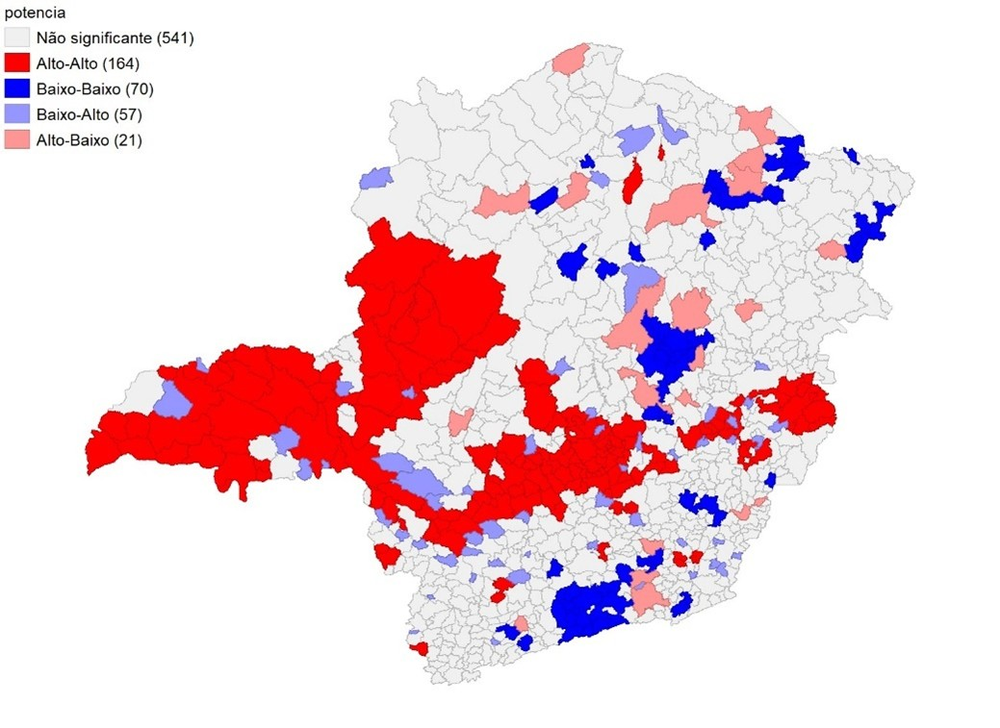
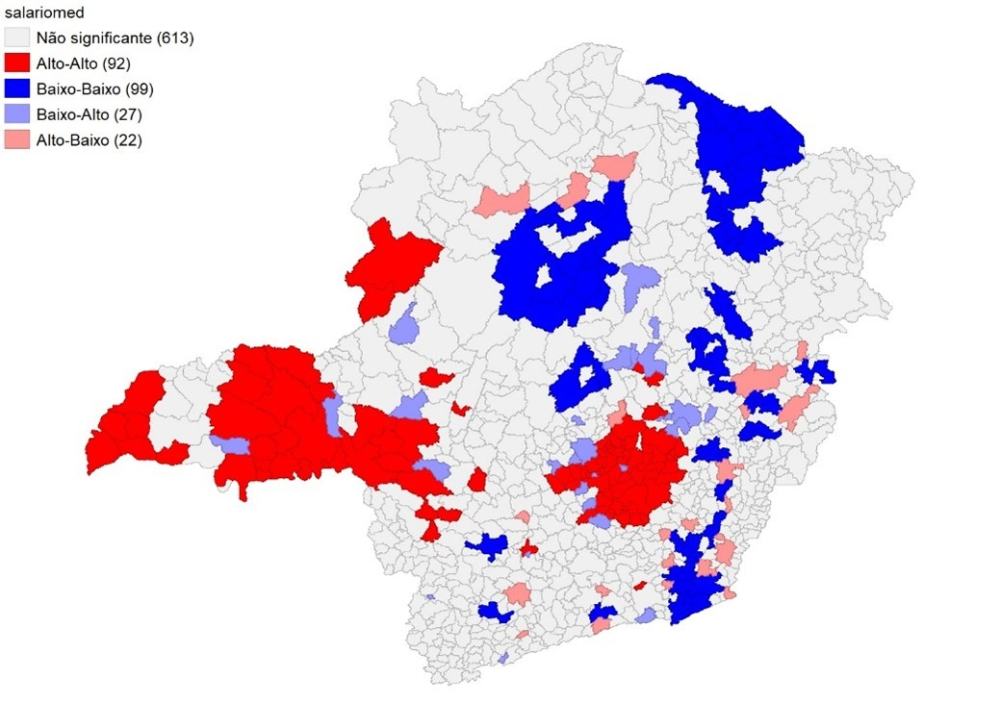
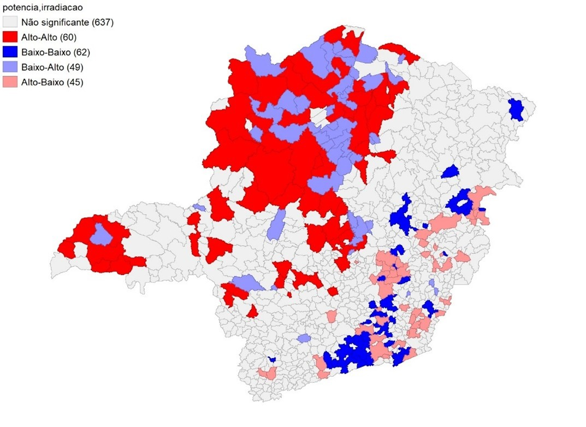

```{css, echo=FALSE}
.paragrafo1 {
  font-family: 'Archivo';
  font-weight: bold; /* Deixa o texto em negrito */
  text-align: justify; /* Justifica o texto */
  color: #384955;
}

.map-title {
  font-family: 'Archivo';
  text-align: center;
  font-weight: bold;
  font-size: 18px;
  margin-bottom: 5px; /* Espaço entre o título e a imagem */
  color: var(--title-color); /* Usa a cor definida para títulos */
}

.map-source {
  font-family: 'Archivo';
  text-align: center;
  font-size: 10px; /* Fonte menor */
  color: gray; /* Cor diferenciada */
  margin-top: 1px;  /* Espaço entre a imagem e a fonte */
}
```

<p class="paragrafo1">O Estado de Minas Gerais apresenta grande heterogeneidade social e regional, como apresentado em nosso texto sobre [a macroeconomia das microrregiões de Minas Gerais](https://raerde.com.br/posts/2025-02-24-a-macroeconomia-das-microrregioes-de-minas-gerais/), portanto, acredita-se que a distribuição das instalações fotovoltaicas não será uniforme. Isso ocorre, pois para que se ocorra o investimento na geração solar é necessário investimento privado ou público, e também questões climáticas e demográficas favoráveis. Nesse texto, apresentaremos a distribuição espacial da geração fotovoltaica distribuída e residencial no Estado de Minas Gerais, com objetivo de identificar clusters regionais e locais com potencialidades inexploradas, e que podem ser alvo de políticas públicas com objetivo de expandir a geração no Estado.</p>


<p class="paragrafo1">Inicialmente, para testar de maneira formal a hipótese de que as instalações fotovoltaicas não se distribuem espacialmente de maneira uniforme no estado foi utilizado um indicador conhecido por I de Moran. O valor desse indicador foi estatisticamente significativo e corroborou com a hipótese inicial. A partir desse resultado, foram serão apresentados três mapas para ilustrar a geração fotovoltaica residencial no Estado. O primeiro mapa ilustra a distribuição das instalações fotovoltaicas. O segundo e o terceiro mapa são relacionados com fatores que se correlacionam positivamente com a geração fotovoltaica, sendo eles: salário médio da população, e um indicador de recurso solar. Essas variáveis foram escolhidas, pois segundo a literatura são fatores que impulsionam a geração solar.</p>


```{r echo=FALSE}
library(htmltools)
htmltools::tags$div(class="map-title", "Figura 1: Clusters – Potência Instalada")
```

```{r echo=FALSE}
htmltools::tags$div(class="map-source", "Fonte: elaborado pelos autores com apoio do software Geoda.")
```


<p class="paragrafo1">Por meio da Figura 1, é possível identificar clusters espaciais na potência instalada em geração solar no estado de Minas Gerais. Nota-se, em especial, a região do Triângulo Mineiro, Noroeste de Minas e a Região Metropolitana de Belo Horizonte, como as regiões que abrigam os clusters alto-alto na geração fotovoltaica no estado. Nessas localidades estão dispostos municípios que apresentam uma alta geração fotovoltaica e cujo vizinhos também apresentam a mesma característica.</p>


<p class="paragrafo1">Entretanto, além do cluster de alta-alta geração, também se nota a presença de alguns clusters de baixa-baixa geração. Essa classe, compreende municípios com baixa geração fotovoltaica instalada, e que são cercados por vizinhos com essa mesma característica. É o caso, principalmente, das regiões da Zona da Mata, Vale do Mucuri e Jequitinhonha e a região Central mineira. Nessas regiões supracitadas, a geração fotovoltaica apresenta um padrão inferior à média contabilizada no estado.</p> 


<p class="paragrafo1">Os dados da variável de potência instalada dizem respeito ao somatório das potências geradas por cada um dos módulos fotovoltaicos presentes nos municípios mineiros. Essas instalações se referem a geração residencial, portanto, a instalação cabe aos habitantes das cidades, sendo assim, fatores socioeconômicos terão peso na escolha em se instalar ou não a energia solar.</p>


<p class="paragrafo1">De acordo com a literatura, a renda é uma importante variável para a instalação de painéis fotovoltaicos, dado o seu custo e o ainda baixo acesso da população como um todo a tal tecnologia. Portanto, acredita-se que em regiões com maior nível de renda, a geração fotovoltaica distribuída tende a se destacar. Dessa maneira, com objetivo de destacar como a renda formal se distribui espacialmente, será apresentado os clusters regionais para a variável de salário médio.</p> 


```{r echo=FALSE}
htmltools::tags$div(class="map-title", "Figura 2: Clusters – Salário Médio")
```

```{r echo=FALSE}
htmltools::tags$div(class="map-source", "Fonte: elaborado pelos autores com apoio do software Geoda.")
```


<p class="paragrafo1">Nota-se que a região do Triângulo Mineiro, RMBH, Noroeste de Minas e Vale do Rio Doce, apresentam clusters alto-alto, ou seja, observações que possuem um coeficiente de salário acima da média global, cercado por vizinhos com essa mesma característica, dado uma matriz do tipo Rainha de primeira ordem. Por sua vez, a região norte, o Vale do Mucuri e Jequitinhonha e Zona da Mata mineira, apresentam observações que possuem baixo salário médio, cujo vizinhos também apresentam a mesma característica.</p>


<p class="paragrafo1">Ao comparar os mapas dispostos na Figura 1 e 2, percebe-se que os locais com clusters de alta renda, também são aqueles em que se identifica clusters de alta produção de eletricidade solar. Isso indica, que o fator renda é importante para a geração fotovoltaica.</p>


<p class="paragrafo1">Além dos indicadores socioeconômicos, a literatura aponta também a necessidade de fatores geográficos favoráveis para o bom aproveitamento do sol como fonte energética. Dentre esses aspectos, incluem a posição em relação a terra como a latitude, e os níveis de irradiação. Logo, pelo fato da irradiação variar de maneira semelhante entre municípios vizinhos, será apresentado um índice bivariado, entre potência instalada e recurso solar. Esse indicador mede o grau em que o valor de uma determinada variável num local está correlacionado com os seus vizinhos para uma variável diferente. Nesse estudo, verifica-se a correlação entre a potência observada no município *i*, para com a irradiação apresentada em seus *j* vizinhos contíguos.</p>


```{r echo=FALSE}
htmltools::tags$div(class="map-title", "Figura 3: I de Moran Bivariado – Potência/Irradiação")
```

```{r echo=FALSE}
htmltools::tags$div(class="map-source", "Fonte: elaborado pelos autores com apoio do software Geoda.")
```


<p class="paragrafo1">A baixa irradiação pode explicar o cluster de baixa-baixa geração solar na Zona da Mata mineira. De acordo com o I de Moran bivariado, é uma região que apresenta observações com baixa potência instalada rodeada por vizinhos com baixa irradiação.</p>


<p class="paragrafo1">Outra região de interesse é o Norte de Minas, que apresenta observações que contém uma baixa potência instalada, entretanto, cercado por vizinhos com alta irradiação. Tal constatação pode ser um indicador para a necessidade de políticas públicas regionais que alavanquem o potencial energético da região. Trata-se de uma região que apresenta uma condição geográfica favorável para a geração solar, entretanto, pouco aproveitada em decorrência de condições socioeconômicas desfavoráveis.</p> 


<p class="paragrafo1">Tais políticas públicas, devido a heterogeneidade do estado de Minas Gerais, devem ser focalizadas nas regiões de interesse, para que a absorção da tecnologia ocorra de maneira exitosa. No Estado, por exemplo, aqueles municípios que apresentam os maiores níveis de recurso solar, também são aqueles cujo nível de renda, escolaridade e pobreza são deficitários, denotando uma correlação entre ambas as variáveis. Logo, tanto a questão geográfica, como os fatores sociais são preponderantes para o desenvolvimento da geração fotovoltaica. Esses municípios que apresentam abundância de recurso solar (geográfico) devem receber políticas que visem consolidar o potencial ainda não atingido na geração solar.</p> 


<p class="paragrafo1">Esse texto, portanto, teve como objetivo apresentar de maneira visual a distribuição da geração fotovoltaica residencial em Minas Gerias. Ademais, buscou correlacionar essa variável com renda e irradiação, sendo tais fatores importantes para a expansão da geração solar no Estado.</p>